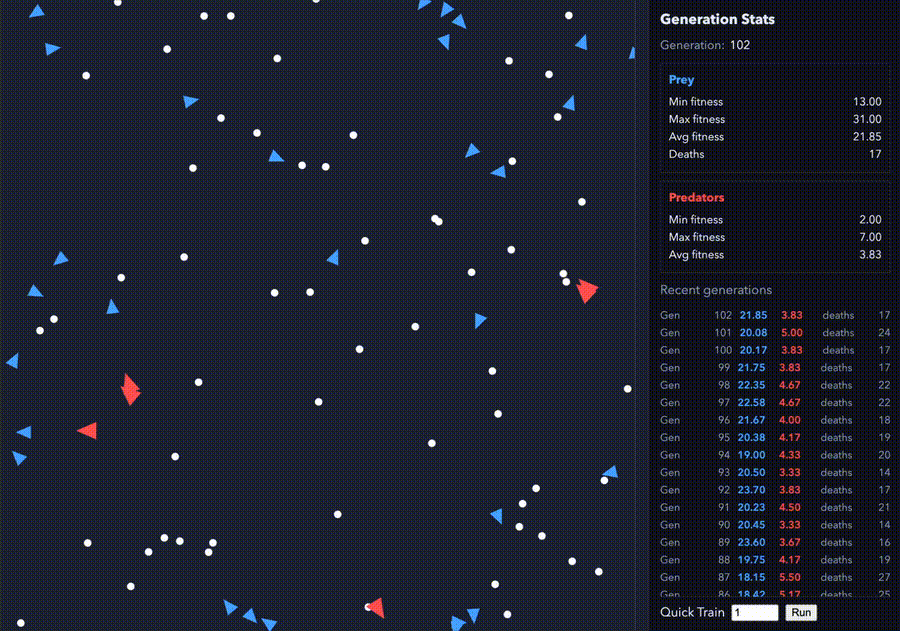
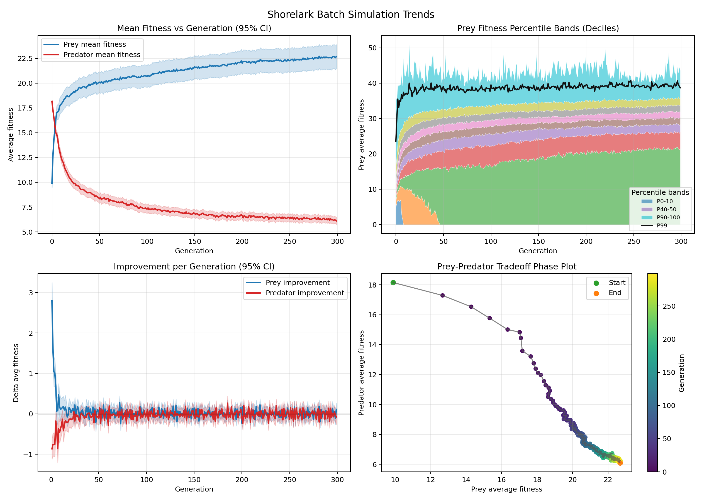

# Shorelark Genetic Algorithm

An interactive evolution sandbox: a genetic algorithm + feed-forward neural network controlling “birds” that learn to find food under configurable selection pressures. Built in Rust (WASM) with a TypeScript front-end for real-time visualization and experimentation.

## Live Demo

Try it here: [Shorelark Predator-Prey Simulation](https://isaacsalzman.com/projects/shorelark-expanded/demo/)



## Problem Statement

While public genetic algorithm projects already exist and are helpful for demonstrating natural selection, most public algorithms rely on libraries that limit transparency and interactivity. This project aims to build on an existing evolution simulation and modifies and adds to the selection pressures in a variety of different ways to visualize the impact on the population. The goal of this project is to create a clear and modifiable sandbox where users can observe the impact of a variety of different selection pressures on the population.

This project also aims to mathematically quantify the improvement rate of the population over time given the input conditions to the simulation and the specific selection pressures being tested.

## How to Build

```bash
# Build Rust code
cd libs/simulation-wasm
wasm-pack build --target bundler --release

# Build TypeScript code
cd ../../www
npm install

# Start the application
npm run start
```

## Batch Experiments (Backend)

```bash
# Run 50 simulations for 100 generations and write CSV
cargo run -p simulation-batch --release -- --runs 50 --gens 100 --out results.csv
```

```bash
# Plot trends from CSV
python3 -m pip install pandas matplotlib numpy
python3 scripts/plot_batch_results.py results.csv --out batch_trends.png
```

### Plotting Improvement



- `Mean Fitness vs Generation (95% CI)`: compares fitness trends and stability across runs.
- `Improvement per Generation (95% CI)`: often shows diminishing gains after early generations.
- `Final Generation Distribution`: summarizes end-state distribution for prey vs predators.
- `Prey-Predator Tradeoff Phase Plot`: maps co-evolution over time by plotting mean prey fitness against mean predator fitness.

## Explanation

This project implements a genetic algorithm in combination with a [Feed-forward neural network](https://en.wikipedia.org/wiki/Feedforward_neural_network) (FFNN). The network receives input from each bird’s visual sensors: the bird’s field of view is divided into discrete “eye cells,” and each cell provides a numeric value representing the distance to the nearest food source. These inputs are processed by the network to produce two outputs: the bird’s forward/backward acceleration and its rotational acceleration.

## Acknowledgements

This project was initially inspired by and prototyped from Patryk Wychowaniec’s “Learning to Fly” article/series:
- Guide: <https://pwy.io/posts/learning-to-fly-pt1/>
